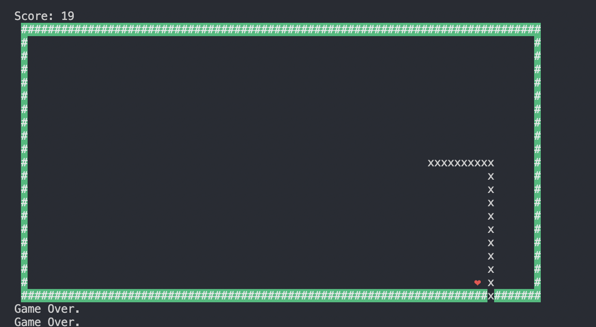

# Greedy-snake
greedy snake In shell. Writing for fun.


### runing

```shell
  bash greedySnake.sh
```

using `aswd` to control the snake. `ctrl+c` or `q` quit the game.

### demo



### ToDo

- multi-threading(processing) listening key press events
- add obstacle feature
- more shape of wall
- local area net
